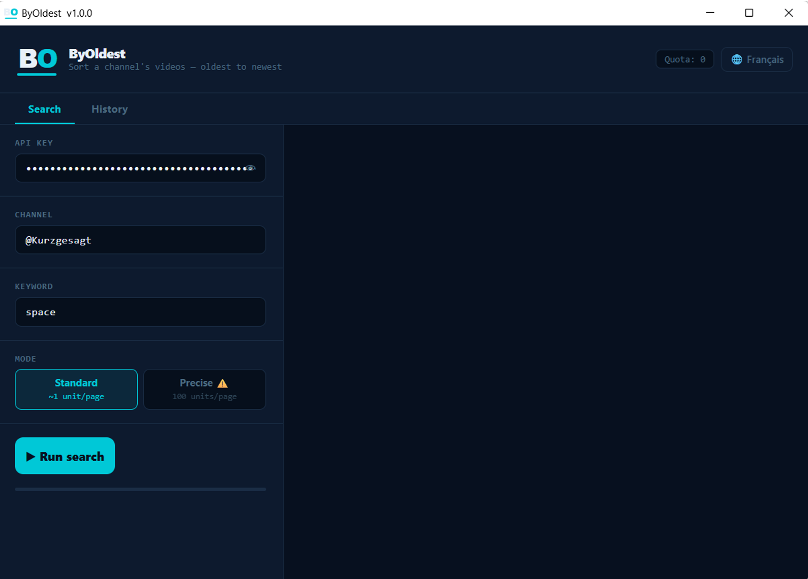
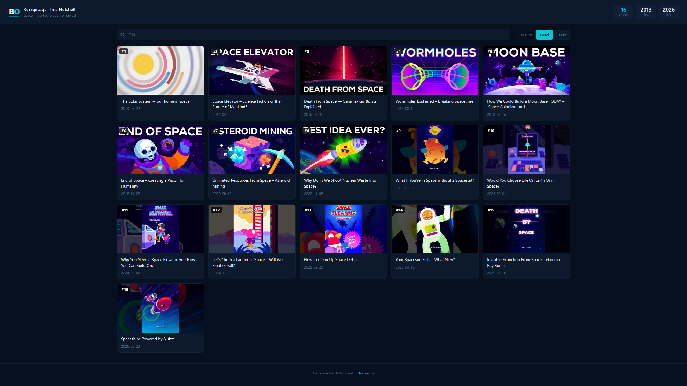

# ByOldest

**Sort a YouTube channel's videos — oldest to newest, or newest to oldest.**

[](https://github.com/alexdth/ByOldest/releases/tag/v1.1.0)

ByOldest is a desktop application that lists all videos from a YouTube channel (or only those matching a keyword), sorted from oldest to newest (or newest to oldest), and generates an interactive HTML file you can browse offline.

---

## Preview

<div align="center">



<br/><br/>



*Example: @Kurzgesagt · keyword `space` — 16 videos found, sorted from 2013 to 2026.*

</div>

---

## Features

- 🔍 Search by YouTube channel (ID, URL or handle `@name`)
- 🗂️ Filter by keyword (or fetch all videos)
- 🔃 Choose sort order — **Oldest → Newest** or **Newest → Oldest**
- 📄 Generates an interactive HTML file (grid / list view, live filter, sort toggle)
- 🕘 History of the last 10 searches with one-click re-run
- 🔐 API key stored securely (Windows Credential Store)
- 🌐 Bilingual interface — English / Français

---

## Usage (exe)

1. Download `ByOldest.exe` from the [Releases](../../releases) page
2. Run the exe — no installation required
3. Enter your YouTube API key *(see below)*
4. Enter the channel URL or ID, an optional keyword, choose the sort order, and click **Run search**
5. The HTML file opens automatically in your browser

> ⚠️ Some antivirus software may flag the exe as suspicious (common false positive with PyInstaller). The full source code is available above for review.

---

## Getting a YouTube API Key

The API key is **free** and required to query YouTube. Google's free quota is more than enough for personal use.

1. Go to [Google Cloud Console](https://console.cloud.google.com/)
2. Create a project (or use an existing one)
3. Go to **APIs & Services → Library**
4. Search for **YouTube Data API v3** and click **Enable**
5. Go to **APIs & Services → Credentials**
6. Click **Create Credentials → API Key**
7. Copy the generated key and paste it into ByOldest

---

## Running from source

### Requirements

- Python 3.9+

```bash
pip install google-api-python-client keyring cryptography pywebview
```

- Optional (Windows native notifications):

```bash
pip install plyer
```

### Run

```bash
python byoldest.py
```

### Build the exe yourself

```bash
pip install pyinstaller
pyinstaller --onefile --windowed --icon="ByOldest.ico" --name "ByOldest" byoldest.py
```

---

## How it works

ByOldest fetches all videos via `playlistItems.list` (~1 quota unit/page), then enriches each result with `videos.list` (1 unit per batch of 50) to get precise `publishedAt` timestamps for reliable sorting.

| Step | API method | Quota cost |
|------|------------|------------|
| Fetch playlist | `playlistItems.list` | ~1 unit/page |
| Enrich timestamps | `videos.list` | ~1 unit/50 videos |

YouTube Data API v3 free quota: **10,000 units/day**.

---

## Privacy & data

- API key stored in the **Windows Credential Store** (never written to disk in plain text)
- Config encrypted locally (AES-128) in `%APPDATA%\ByOldest\`
- Generated HTML files saved in `%APPDATA%\ByOldest\history\`
- No data is sent to any third-party server — all requests go directly to Google's YouTube API

---

## License

Personal, non-commercial use only. See the [LICENSE](LICENSE) file for details.

© 2026 Kero — All rights reserved.

---

<br>

---

# ByOldest *(Français)*

**Trier les vidéos d'une chaîne YouTube — de la plus ancienne à la plus récente, ou l'inverse.**

[](https://github.com/alexdth/ByOldest/releases/tag/v1.1.0)

ByOldest est une application de bureau qui liste toutes les vidéos d'une chaîne YouTube (ou uniquement celles correspondant à un mot-clé), triées de la plus ancienne à la plus récente (ou l'inverse), et en génère un fichier HTML interactif consultable hors ligne.

---

## Aperçu

<div align="center">


<br/><br/>


*Exemple : @Kurzgesagt · mot-clé `space` — 16 vidéos trouvées, triées de 2013 à 2026.*

</div>

---

## Fonctionnalités

- 🔍 Recherche par chaîne YouTube (ID, URL ou handle `@nom`)
- 🗂️ Filtrage par mot-clé (ou toutes les vidéos)
- 🔃 Choix de l'ordre — **Plus ancien → Plus récent** ou **Plus récent → Plus ancien**
- 📄 Génération d'un fichier HTML interactif (vue grille / liste, filtre en temps réel, toggle de tri)
- 🕘 Historique des 10 dernières recherches avec relance en un clic
- 🔐 Clé API stockée de façon sécurisée (Windows Credential Store)
- 🌐 Interface bilingue Français / English

---

## Utilisation (exe)

1. Télécharge `ByOldest.exe` depuis la page [Releases](../../releases)
2. Lance l'exe — aucune installation requise
3. Entre ta clé API YouTube *(voir ci-dessous)*
4. Entre l'URL ou l'ID de la chaîne, un mot-clé optionnel, choisis l'ordre, et clique sur **Lancer la recherche**
5. Le fichier HTML s'ouvre automatiquement dans ton navigateur

> ⚠️ Certains antivirus peuvent afficher un faux positif sur l'exe (comportement courant avec PyInstaller). Le code source est disponible ci-dessus pour vérification.

---

## Obtenir une clé API YouTube

La clé API est **gratuite** et nécessaire pour interroger YouTube. Le quota gratuit de Google est largement suffisant pour un usage personnel.

1. Va sur [Google Cloud Console](https://console.cloud.google.com/)
2. Crée un projet (ou utilise un projet existant)
3. Dans le menu, va dans **APIs & Services → Bibliothèque**
4. Recherche **YouTube Data API v3** et clique sur **Activer**
5. Va dans **APIs & Services → Identifiants**
6. Clique sur **Créer des identifiants → Clé API**
7. Copie la clé générée et colle-la dans ByOldest

---

## Utilisation depuis le code source

### Prérequis

- Python 3.9+

```bash
pip install google-api-python-client keyring cryptography pywebview
```

- Optionnel (notifications Windows natives) :

```bash
pip install plyer
```

### Lancement

```bash
python byoldest.py
```

### Générer l'exe soi-même

```bash
pip install pyinstaller
pyinstaller --onefile --windowed --icon="ByOldest.ico" --name "ByOldest" byoldest.py
```

L'exe sera généré dans le dossier `dist/`.

---

## Comment ça fonctionne

ByOldest récupère toutes les vidéos via `playlistItems.list` (~1 unité de quota/page), puis enrichit chaque résultat avec `videos.list` (1 unité par lot de 50) pour obtenir des timestamps `publishedAt` précis à la seconde et trier correctement.

| Étape | Méthode API | Coût quota |
|-------|-------------|------------|
| Récupération playlist | `playlistItems.list` | ~1 unité/page |
| Enrichissement timestamps | `videos.list` | ~1 unité/50 vidéos |

Le quota gratuit de YouTube Data API v3 est de **10 000 unités/jour**.

---

## Données & vie privée

- La clé API est stockée dans le **Windows Credential Store** (jamais en clair sur le disque)
- La configuration est chiffrée localement (AES-128) dans `%APPDATA%\ByOldest\`
- Les fichiers HTML générés sont sauvegardés dans `%APPDATA%\ByOldest\history\`
- Aucune donnée n'est envoyée à un serveur tiers — tout passe directement par l'API YouTube de Google

---

## Licence

Usage personnel et non-commercial uniquement. Voir le fichier [LICENSE](LICENSE) pour les détails.

© 2026 Kero — All rights reserved.
